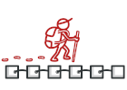

# INTRODUCCIÓN

## ¿QUÉ ES UN PATRÓN DE DISEÑO?

Los patrones de diseño son soluciones habituales a problemas que ocurren con frecuencia en el diseño de software. Son como planos prefabricados que se pueden personalizar para resolver un problema de diseño recurrente en tu código.

No se puede elegir un patrón y copiarlo en el programa como si se tratara de funciones o bibliotecas ya preparadas. El patrón no es una porción específica de código, sino un concepto general para resolver un problema particular. Puedes seguir los detalles del patrón e implementar una solución que encaje con las realidades de tu propio programa.

A menudo los patrones se confunden con algoritmos porque ambos conceptos describen soluciones típicas a problemas conocidos. Mientras que un algoritmo siempre define un grupo claro de acciones para lograr un objetivo, un patrón es una descripción de más alto nivel de una solución. El código del mismo patrón aplicado a dos programas distintos puede ser diferente.

Una analogía de un algoritmo sería una receta de cocina: ambos cuentan con pasos claros para alcanzar una meta. Por su parte, un patrón es más similar a un plano, ya que puedes observar cómo son su resultado y sus funciones, pero el orden exacto de la implementación depende de ti.

### ¿EN QUÉ CONSISTE EL PATRÓN?

La mayoría de los patrones se describe con mucha formalidad para que la gente pueda reproducirlos en muchos contextos. Aquí tienes las secciones que suelen estar presentes en la descripción de un patrón:

- El **propósito** del patrón explica brevemente el problema y la solución.
- La **motivación** explica en más detalle el problema y la solución que brinda el patrón.
- La **estructura** de las clases muestra cada una de las partes del patrón y el modo en que se relacionan.
- El **ejemplo de código** en uno de los lenguajes de programación populares facilita la asimilación de la idea que se esconde tras el patrón.
  
Algunos catálogos de patrones enumeran otros detalles útiles, como la aplicabilidad del patrón, los pasos de implementación y las relaciones con otros patrones.

## HISTORIA DE LOS PATRONES

¿Quién inventó los patrones de diseño? Esa es una buena, aunque imprecisa pregunta. Los patrones de diseño no son conceptos opacos y sofisticados, al contrario. Los patrones son soluciones habituales a problemas comunes en el diseño orientado a objetos. Cuando una solución se repite una y otra vez en varios proyectos, al final alguien le pone un nombre y explica la solución en detalle. Básicamente, así es como se descubre un patrón.

El concepto de los patrones fue descrito por Christopher Alexander en El lenguaje de patrones. El libro habla de un “lenguaje” para diseñar el entorno urbano. Las unidades de este lenguaje son los patrones. Pueden describir lo altas que tienen que ser las ventanas, cuántos niveles debe tener un edificio, cuan grandes deben ser las zonas verdes de un barrio, etcétera.

La idea fue recogida por cuatro autores: Erich Gamma, John Vlissides, Ralph Johnson y Richard Helm. En 1995, publicaron Patrones de diseño, en el que aplicaron el concepto de los patrones de diseño a la programación. El libro presentaba 23 patrones que resolvían varios problemas del diseño orientado a objetos y se convirtió en un éxito de ventas con rapidez. Al tener un título tan largo en inglés, la gente empezó a llamarlo “el libro de la ‘gang of four’ (banda de los cuatro)”, lo que pronto se abrevió a “el libro GoF”.

Desde entonces se han descubierto decenas de nuevos patrones orientados a objetos. La “metodología del patrón” se hizo muy popular en otros campos de la programación, por lo que hoy en día existen muchos otros patrones no relacionados con el diseño orientado a objetos.

## ¿POR QUÉ DEBERÍA APRENDER SOBRE PATRONES?

La realidad es que podrías trabajar durante años como programador sin conocer un solo patrón. Mucha gente lo hace. Incluso en ese caso, podrías estar implementando patrones sin saberlo. Así que, ¿por qué dedicar tiempo a aprenderlos?

Los patrones de diseño son un juego de herramientas de soluciones comprobadas a problemas habituales en el diseño de software. Incluso aunque nunca te encuentres con estos problemas, conocer los patrones sigue siendo de utilidad, porque te enseña a resolver todo tipo de problemas utilizando principios del diseño orientado a objetos.

Los patrones de diseño definen un lenguaje común que puedes utilizar con tus compañeros de equipo para comunicaros de forma más eficiente. Podrías decir: “Oh, utiliza un singleton para eso”, y todos entenderían la idea de tu sugerencia. No habría necesidad de explicar qué es un singleton si conocen el patrón y su nombre.

## CRÍTICA DE LOS PATRONES

a la sensación de que todos los holgazanes han criticado ya los patrones de diseño. Veamos los argumentos más habituales contra el uso de los patrones.

**Chapuzas para un lenguaje de programación débil**

Normalmente, la necesidad por los patrones surge cuando la gente elige un lenguaje de programación o una tecnología que carece del nivel necesario de abstracción. En este caso, los patrones se convierten en una chapuza que otorga al lenguaje unas súper habilidades muy necesitadas.

Por ejemplo, el patrón Strategy puede implementarse con una simple función anónima (lambda) en la mayoría de lenguajes de programación modernos.

**Soluciones ineficientes**

Los patrones intentan sistematizar soluciones cuyo uso ya es generalizado. Esta unificación es vista por muchos como un dogma, e implementan los patrones “al pie de la letra”, sin adaptarlos al contexto del proyecto particular.

**Uso injustificado**

``Si lo único que tienes es un martillo, todo te parecerá un clavo.``

Este es el problema que persigue a muchos principiantes que acaban de familiarizarse con los patrones. Una vez que aprenden sobre patrones, intentan aplicarlos en todas partes, incluso en situaciones en las que un código más simple funcionaría perfectamente bien.

## CLASIFICACIÓN DE LOS PATRONES

Los patrones de diseño varían en su complejidad, nivel de detalle y escala de aplicabilidad al sistema completo que se diseña. Me gusta la analogía de la construcción de carreteras: puedes hacer más segura una intersección instalando semáforos o construyendo un intercambiador completo de varios niveles con pasajes subterráneos para peatones.

Los patrones más básicos y de más bajo nivel suelen llamarse idioms. Normalmente se aplican a un único lenguaje de programación.

Los patrones más universales y de más alto nivel son los patrones de arquitectura. Los desarrolladores pueden implementar estos patrones prácticamente en cualquier lenguaje. Al contrario que otros patrones, pueden utilizarse para diseñar la arquitectura de una aplicación completa.

Además, todos los patrones pueden clasificarse por su propósito. Este libro cubre tres grupos generales de patrones:

Los **patrones creacionales** proporcionan mecanismos de creación de objetos que incrementan la flexibilidad y la reutilización de código existente.

Los **patrones estructurales** explican cómo ensamblar objetos y clases en estructuras más grandes a la vez que se mantiene la flexibilidad y eficiencia de la estructura.

Los **patrones de comportamiento** se encargan de una comunicación efectiva y la asignación de responsabilidades entre objetos.

# EL CATÁLOGO DE PATRONES DE DISEÑO

## PATRONES CREACIONALES

Estos patrones proporcionan mecanismos de creación de objetos que incrementan la flexibilidad y la reutilización del código existente.

Imagen | Patrón | Puntuación | Descripción
--- | --- | --- | ---
 | [Abstract Factory](https://github.com/FernandoCalmet/Design-Patterns/wiki/abstract_factory) | ⭐⭐⭐ | Permite producir familias de objetos relacionados sin especificar sus clases concretas.
 | [Builder](https://github.com/FernandoCalmet/Design-Patterns/wiki/builder) | ⭐⭐⭐ | Permite construir objetos complejos paso a paso. Este patrón nos permite producir distintos tipos y representaciones de un objeto empleando el mismo código de construcción.
 | [Factory Method](https://github.com/FernandoCalmet/Design-Patterns/wiki/factory_method) | ⭐⭐⭐ | Proporciona una interfaz para la creación de objetos en una superclase, mientras permite a las subclases alterar el tipo de objetos que se crearán.
 | [Prototype](https://github.com/FernandoCalmet/Design-Patterns/wiki/prototype) | ⭐⭐ | Permite copiar objetos existentes sin que el código dependa de sus clases.
 | [Singleton](https://github.com/FernandoCalmet/Design-Patterns/wiki/singleton) | ⭐⭐ | Permite asegurarnos de que una clase tenga una única instancia, a la vez que proporciona un punto de acceso global a dicha instancia.

## PATRONES ESTRUCTURALES

Estos patrones explican cómo ensamblar objetos y clases en estructuras más grandes, mientras se mantiene la flexibilidad y eficiencia de la estructura.

Imagen | Patrón | Puntuación | Descripción
--- | --- | --- | ---
 | [Adapter](https://github.com/FernandoCalmet/Design-Patterns/wiki/adapter) | ⭐⭐⭐ | Permite la colaboración entre objetos con interfaces incompatibles.
 | [Bridge](https://github.com/FernandoCalmet/Design-Patterns/wiki/bridge) | ⭐ | Permite dividir una clase grande o un grupo de clases estrechamente relacionadas, en dos jerarquías separadas (abstracción e implementación) que pueden desarrollarse independientemente la una de la otra.
 | [Composite](https://github.com/FernandoCalmet/Design-Patterns/wiki/composite) | ⭐⭐ | Permite componer objetos en estructuras de árbol y trabajar con esas estructuras como si fueran objetos individuales.
 | [Decorator](https://github.com/FernandoCalmet/Design-Patterns/wiki/decorator) | ⭐⭐ | Permite añadir funcionalidades a objetos colocando estos objetos dentro de objetos encapsuladores especiales que contienen estas funcionalidades.
 | [Facade](https://github.com/FernandoCalmet/Design-Patterns/wiki/facade) | ⭐⭐ | Proporciona una interfaz simplificada a una biblioteca, un framework o cualquier otro grupo complejo de clases.
 | [Flyweight](https://github.com/FernandoCalmet/Design-Patterns/wiki/flyweight) | ⭐ | Permite mantener más objetos dentro de la cantidad disponible de memoria RAM compartiendo las partes comunes del estado entre varios objetos en lugar de mantener toda la información en cada objeto.
 | [Proxy](https://github.com/FernandoCalmet/Design-Patterns/wiki/proxy) | ⭐ | Permite proporcionar un sustituto o marcador de posición para otro objeto. Un proxy controla el acceso al objeto original, permitiéndote hacer algo antes o después de que la solicitud llegue al objeto original.
` ` | [Repository](https://github.com/FernandoCalmet/Design-Patterns/wiki/repository) | ⭐⭐⭐ | En medio entre el dominio y las capas de mapeo de datos utilizando una interfaz similar a una colección para acceder a los objetos del dominio.

## PATRONES DE COMPORTAMIENTO

Estos patrones tratan con algoritmos y la asignación de responsabilidades entre objetos.

Imagen | Patrón | Puntuación | Descripción
--- | --- | --- | ---
 | [Chain of Responsibility](https://github.com/FernandoCalmet/Design-Patterns/wiki/chain_of_responsibility) | ⭐ | Permite pasar solicitudes a lo largo de una cadena de manejadores. Al recibir una solicitud, cada manejador decide si la procesa o si la pasa al siguiente manejador de la cadena.
 | [Command](https://github.com/FernandoCalmet/Design-Patterns/wiki/command) | ⭐⭐⭐ | Convierte una solicitud en un objeto independiente que contiene toda la información sobre la solicitud. Esta transformación te permite parametrizar los métodos con diferentes solicitudes, retrasar o poner en cola la ejecución de una solicitud y soportar operaciones que no se pueden realizar.
 | [Iterator](https://github.com/FernandoCalmet/Design-Patterns/wiki/iterator) | ⭐⭐⭐ | Permite recorrer elementos de una colección sin exponer su representación subyacente (lista, pila, árbol, etc.).
 | [Mediator](https://github.com/FernandoCalmet/Design-Patterns/wiki/mediator) | ⭐⭐ | Permite reducir las dependencias caóticas entre objetos. El patrón restringe las comunicaciones directas entre los objetos, forzándolos a colaborar únicamente a través de un objeto mediador
 | [Memento](https://github.com/FernandoCalmet/Design-Patterns/wiki/memento) | ⭐⭐ | Permite guardar y restaurar el estado previo de un objeto sin revelar los detalles de su implementación.
 | [Observer](https://github.com/FernandoCalmet/Design-Patterns/wiki/observer) | ⭐⭐⭐ | Permite definir un mecanismo de suscripción para notificar a varios objetos sobre cualquier evento que le suceda al objeto que están observando.
 | [State](https://github.com/FernandoCalmet/Design-Patterns/wiki/state) | ⭐⭐⭐ | Permite a un objeto alterar su comportamiento cuando su estado interno cambia. Parece como si el objeto cambiara su clase.
 | [Strategy](https://github.com/FernandoCalmet/Design-Patterns/wiki/strategy) | ⭐⭐⭐ | Permite definir una familia de algoritmos, colocar cada uno de ellos en una clase separada y hacer sus objetos intercambiables.
 | [Template Method](https://github.com/FernandoCalmet/Design-Patterns/wiki/template_method) | ⭐⭐ | Define el esqueleto de un algoritmo en la superclase pero permite que las subclases sobrescriban pasos del algoritmo sin cambiar su estructura.
 | [Visitor](https://github.com/FernandoCalmet/Design-Patterns/wiki/visitor) | ⭐⭐ | Permite separar algoritmos de los objetos sobre los que operan.

